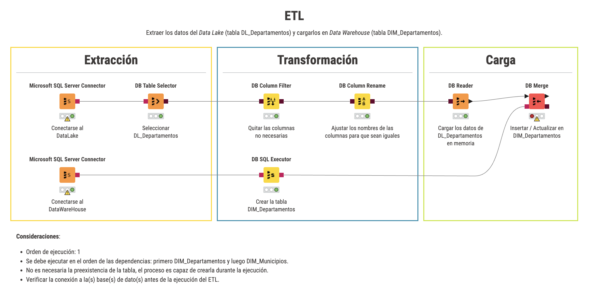

# ETL
Extraer los datos del Data Lake (tabla DL_Departamentos) y cargarlos en Data Warehouse (tabla DIM_Departamentos).

# Consideraciones:
- Orden de ejecución: 1
- Se debe ejecutar en el orden de las dependencias: primero DIM_Departamentos y luego DIM_Municipios.
- No es necesaria la preexistencia de la tabla, el proceso es capaz de crearla durante la ejecución.
- Verificar la conexión a la(s) base(s) de dato(s) antes de la ejecución del ETL.
