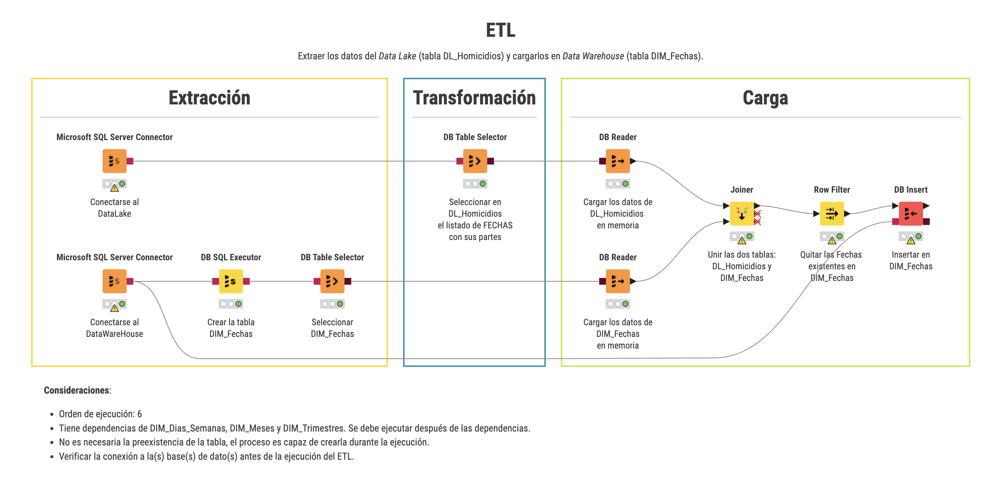

# ETL
Extraer los datos del Data Lake (tabla DL_Homicidios) y cargarlos en Data Warehouse (tabla DIM_Fechas).

# Consideraciones:
- Orden de ejecución: 6
- Tiene dependencias de DIM_Dias_Semanas, DIM_Meses y DIM_Trimestres. Se debe ejecutar después de las dependencias.
- No es necesaria la preexistencia de la tabla, el proceso es capaz de crearla durante la ejecución.
- Verificar la conexión a la(s) base(s) de dato(s) antes de la ejecución del ETL.
