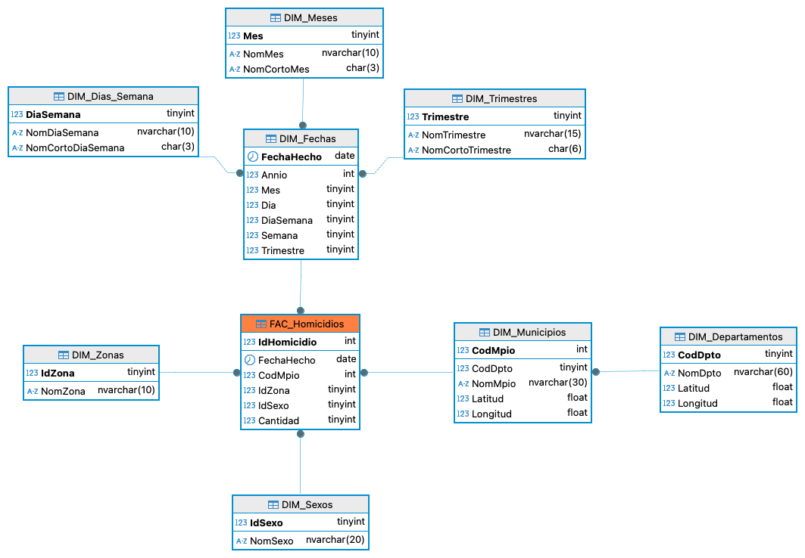

# Data Warehouse
Diseño de un _almacen central de datos_ con modelado de _dimensiones_ y _hechos_ para el análisis de los Homicidios en Colombia.

1. **Scripts**: Contiene el código SQL de las tablas que almacenarán los datos extraídos, transformados y cargados desde el Data Lake.
2. **Modelo ER**: Modelo Entidad Relación de Copo de Nieve del Data Warehouse.

