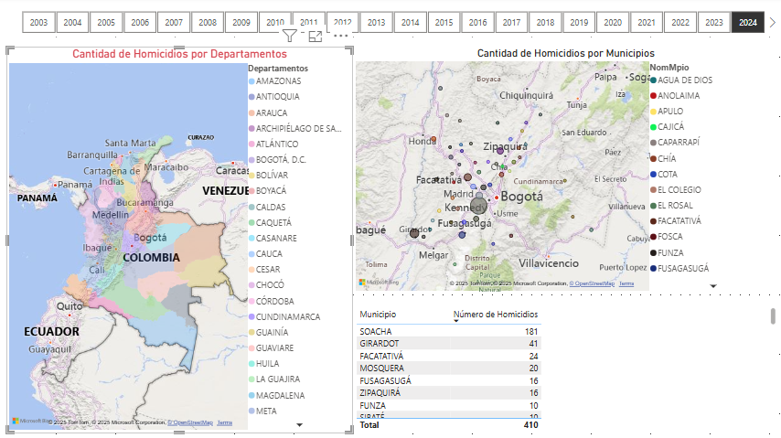
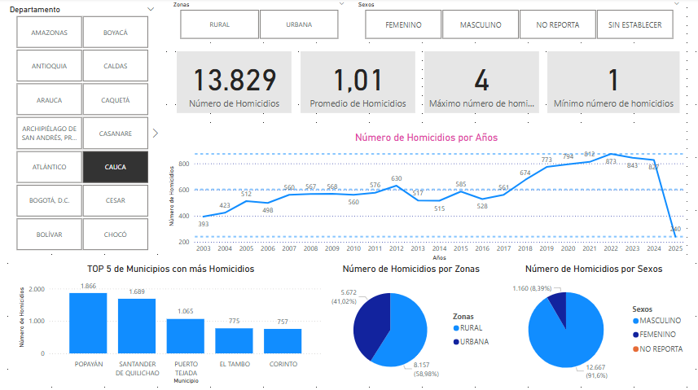
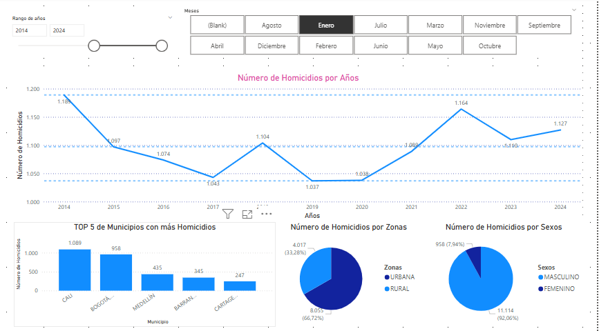

# Power BI
Diseño de un _Dashboard_ utilizando _Power BI_ para el análisis de los Homicidios en Colombia.

1. **Georreferenciación**: Permite la navegación en un mapa por Departamentos y Municipios.

3. **Tendencia**: Permite ver la tendencia de homicidios ocurridos en un gráfico de _Línea_. Se pueden aplicar filtros por Zonas y por Sexos. También muestra el Top 5 de los Municipios por Departamento con más homicidios.

4. **Años y Meses**: Permite ver la tendencia de homicidios ocurridos en un gráfico de _Línea_. Se pueden aplicar filtros por Rango de Años y por Meses. También muestra el Top 5 de los Municipios por Departamento con más homicidios. 

